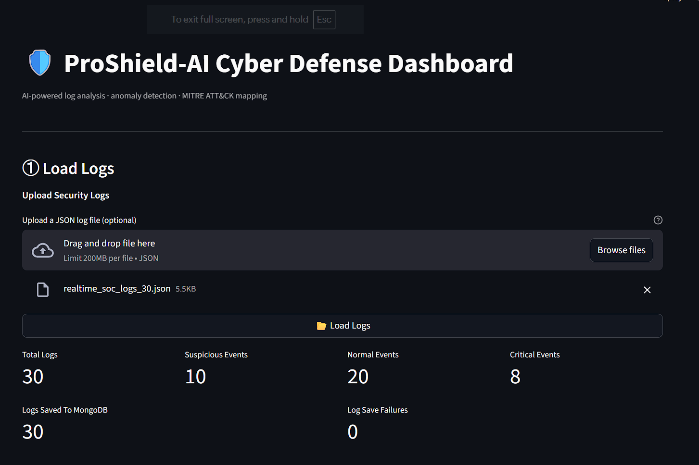
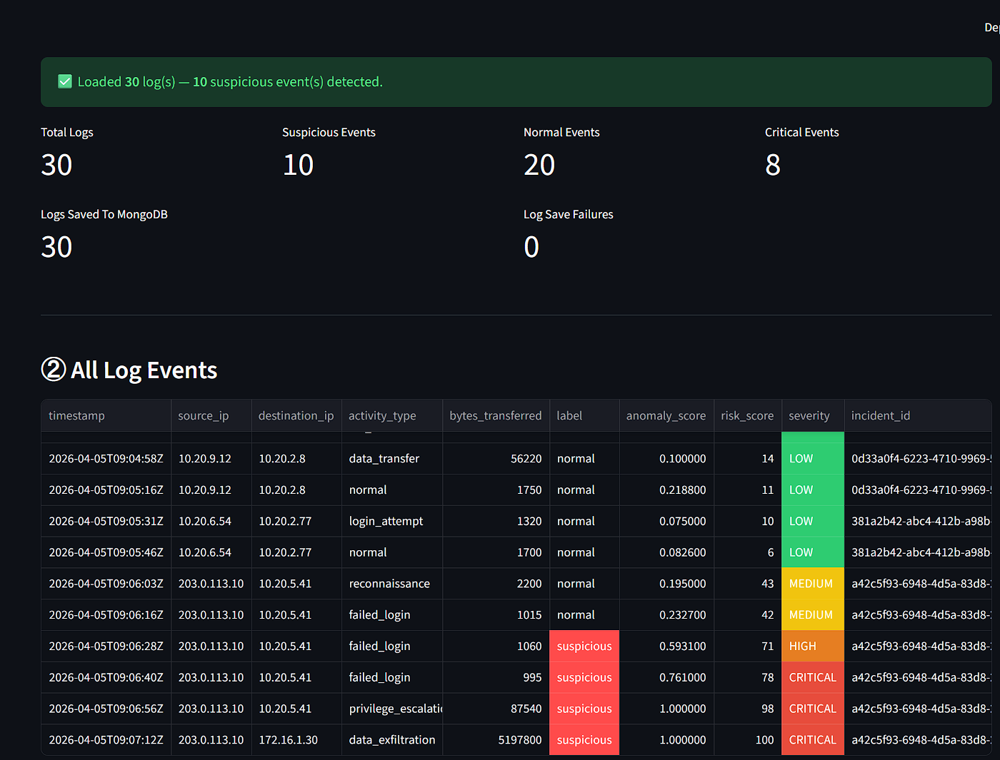
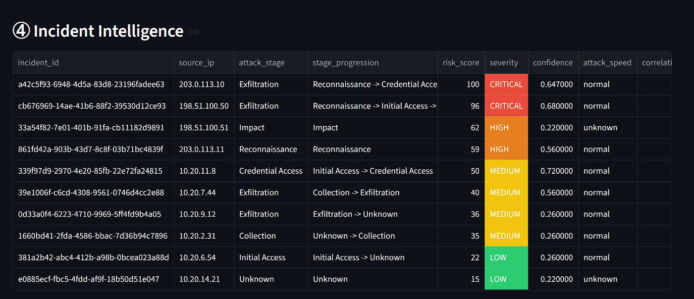
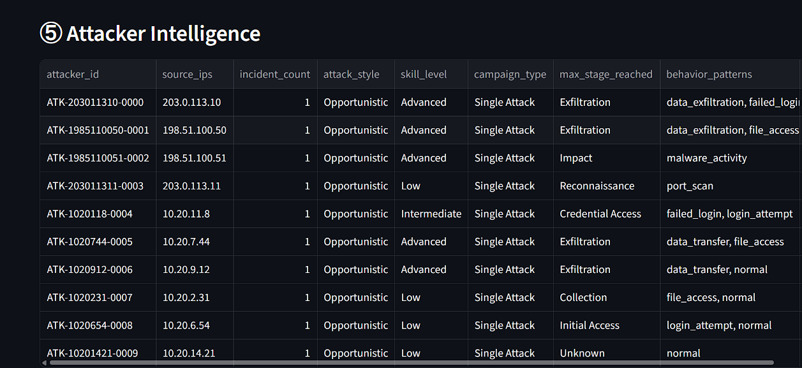
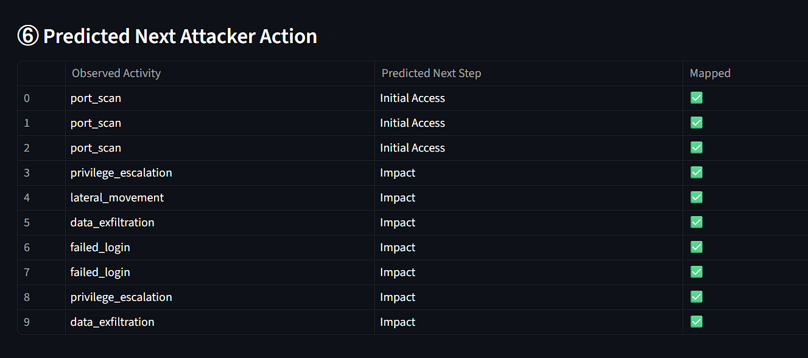
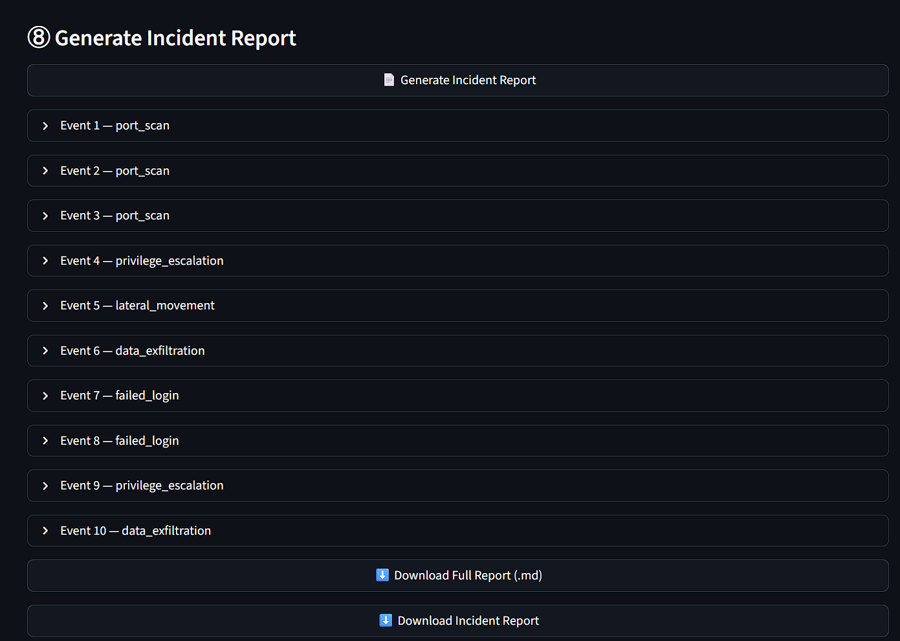

🛡️ ProShield-AI Cyber Defense System

🚨 An AI-powered SOC platform that not only detects threats but also analyzes attacker behavior and predicts next actions — moving from alert-based monitoring to decision-driven security.

---

💡 Why This Project Stands Out

Unlike basic log analysis tools, this system:

- Combines Detection + Intelligence + Prediction in one pipeline
- Simulates a real-world SOC workflow end-to-end
- Maps activities to the MITRE ATT&CK framework
- Generates actionable incident reports automatically

👉 Focus: Reducing analyst effort while improving threat understanding

---

🚀 Key Capabilities

- 🔍 Log ingestion and parsing
- 🚨 Anomaly detection with risk scoring
- 🧠 Incident intelligence with attack stage tracking
- 👨‍💻 Attacker profiling and behavior analysis
- 🔮 Prediction of next attacker actions
- 🧩 MITRE ATT&CK mapping
- 📄 Automated incident reporting

---

🔄 System Workflow

Log Ingestion → Detection Engine → Incident Intelligence → Attacker Intelligence → Prediction → MITRE Mapping → Reporting

---

📊 System Dashboard

Shows:

- Total logs processed
- Suspicious vs normal events
- Critical alerts overview

---

📜 Log Analysis

Shows:

- Raw log events
- Source & destination IP tracking
- Severity classification

---

🚨 Anomaly Detection

Shows:

- ML-based anomaly scoring
- Identification of suspicious activity
- Risk scoring

---

🧠 Incident Intelligence

Shows:

- Attack stage identification
- Stage progression (Recon → Access → Exfiltration)

---

👨‍💻 Attacker Intelligence

Shows:

- Attacker profiling
- Skill level estimation
- Behavior patterns

---

🔮 Attack Prediction

Shows:

- Predicted next attacker actions
- Behavior-based forecasting

---

🧩 MITRE ATT&CK Mapping

Shows:

- Mapping to MITRE techniques (Txxxx)
- Tactical classification

---

📄 Incident Reporting

Shows:

- Auto-generated incident reports
- Downloadable summaries

---

⚙️ Tech Stack

- Python
- Streamlit
- Pandas / NumPy
- Machine Learning (Anomaly Detection)
- MongoDB

---

▶️ How to Run

pip install -r requirements.txt
streamlit run app.py

---

📈 Project Value

- Simulates real SOC operations workflow
- Demonstrates detection → analysis → prediction pipeline
- Bridges gap between alerts and actionable intelligence

---

🔮 Future Improvements

- Real-time threat intelligence integration
- SIEM integration (Splunk / ELK)
- Advanced correlation engine
- AI-based alert summarization

---

👤 Author

 Kalluri Vishal Reddy
